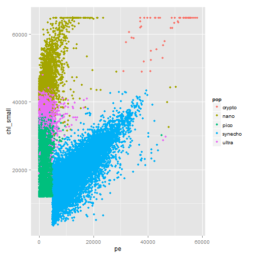
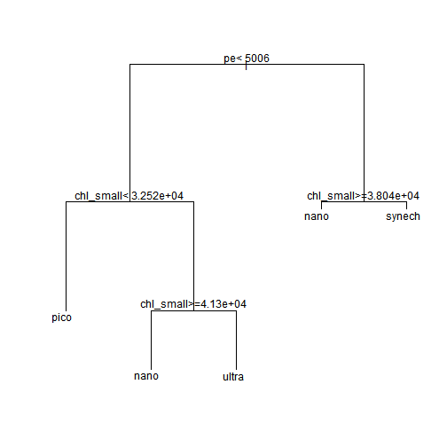

### Install and Load Packages

```r
# install.packages('caret') install.packages('rpart')
# install.packages('tree') install.packages('randomForest')
# install.packages('e1071') install.packages('ggplot2')
# install.packages('caTools')
library(caret)
```

```
## Warning: package 'caret' was built under R version 3.1.1
```

```
## Loading required package: lattice
## Loading required package: ggplot2
```

```
## Warning: package 'ggplot2' was built under R version 3.1.1
```

```r
library(rpart)
```

```
## Warning: package 'rpart' was built under R version 3.1.1
```

```r
library(tree)
```

```
## Warning: package 'tree' was built under R version 3.1.1
```

```r
library(randomForest)
```

```
## Warning: package 'randomForest' was built under R version 3.1.1
```

```
## randomForest 4.6-10
## Type rfNews() to see new features/changes/bug fixes.
```

```r
library(e1071)
```

```
## Warning: package 'e1071' was built under R version 3.1.1
```

```r
library(ggplot2)
library(caTools)
```

```
## Warning: package 'caTools' was built under R version 3.1.1
```


### Read in Data

```r
data <- read.csv("seaflow_21min.csv")
```


### Look at the Summary

```r
summary(data)
```

```
##     file_id         time        cell_id            d1       
##  Min.   :203   Min.   : 12   Min.   :    0   Min.   : 1328  
##  1st Qu.:204   1st Qu.:174   1st Qu.: 7486   1st Qu.: 7296  
##  Median :206   Median :362   Median :14995   Median :17728  
##  Mean   :206   Mean   :342   Mean   :15008   Mean   :17039  
##  3rd Qu.:208   3rd Qu.:503   3rd Qu.:22401   3rd Qu.:24512  
##  Max.   :209   Max.   :643   Max.   :32081   Max.   :54048  
##        d2          fsc_small        fsc_perp        fsc_big     
##  Min.   :   32   Min.   :10005   Min.   :    0   Min.   :32384  
##  1st Qu.: 9584   1st Qu.:31341   1st Qu.:13496   1st Qu.:32400  
##  Median :18512   Median :35483   Median :18069   Median :32400  
##  Mean   :17437   Mean   :34919   Mean   :17646   Mean   :32405  
##  3rd Qu.:24656   3rd Qu.:39184   3rd Qu.:22243   3rd Qu.:32416  
##  Max.   :54688   Max.   :65424   Max.   :63456   Max.   :32464  
##        pe          chl_small        chl_big           pop       
##  Min.   :    0   Min.   : 3485   Min.   :    0   crypto :  102  
##  1st Qu.: 1635   1st Qu.:22525   1st Qu.: 2800   nano   :12698  
##  Median : 2421   Median :30512   Median : 7744   pico   :20860  
##  Mean   : 5325   Mean   :30164   Mean   : 8328   synecho:18146  
##  3rd Qu.: 5854   3rd Qu.:38299   3rd Qu.:12880   ultra  :20537  
##  Max.   :58675   Max.   :64832   Max.   :57184
```


## Step 1: Read and summarize the data

### Question 1   
How many particles labeled "synecho" are in the file provided?

```r
sum(data$pop == "synecho")
```

```
## [1] 18146
```

```r
summary(data$pop)
```

```
##  crypto    nano    pico synecho   ultra 
##     102   12698   20860   18146   20537
```

```r
table(data$pop)
```

```
## 
##  crypto    nano    pico synecho   ultra 
##     102   12698   20860   18146   20537
```


### Question 2
What is the 3rd Quantile of the field fsc_small? 

```r
summary(data$fsc_small)
```

```
##    Min. 1st Qu.  Median    Mean 3rd Qu.    Max. 
##   10000   31300   35500   34900   39200   65400
```

```r
sort(data$fsc_small)[nrow(data) * 0.75]
```

```
## [1] 39184
```


## Step 2: Split the data into test and training sets


```r
set.seed(123)
split <- sample.split(data$pop, SplitRatio = 1/2)
train <- subset(data, split == T)
test <- subset(data, split == F)
```


### Question 3
What is the mean of the variable "time" for your training set?

```r
mean(train$time)
```

```
## [1] 342.1
```


## Step 3: Plot the data

```r
ggplot(train, aes(x = pe, y = chl_small, color = pop)) + geom_point()
```

 


### Question 4
In the plot of pe vs. chl_small, the particles labeled ultra should appear to be somewhat "mixed" with two other populations of particles. Which two populations?

 pico nano


## Step 4: Train a decision tree.


```r
model <- rpart(pop ~ fsc_small + fsc_perp + fsc_big + pe + chl_big + chl_small, 
    method = "class", data = train)
```


```r
print(model)
```

```
## n= 36171 
## 
## node), split, n, loss, yval, (yprob)
##       * denotes terminal node
## 
##  1) root 36171 25740 pico (0.0014 0.18 0.29 0.25 0.28)  
##    2) pe< 5006 26306 15930 pico (0 0.22 0.39 3.8e-05 0.38)  
##      4) chl_small< 3.252e+04 11731  2164 pico (0 0.00034 0.82 8.5e-05 0.18) *
##      5) chl_small>=3.252e+04 14575  6634 ultra (0 0.4 0.056 0 0.54)  
##       10) chl_small>=4.13e+04 5097   607 nano (0 0.88 0.0002 0 0.12) *
##       11) chl_small< 4.13e+04 9478  2143 ultra (0 0.14 0.085 0 0.77) *
##    3) pe>=5006 9865   793 synecho (0.0052 0.053 0.0053 0.92 0.017)  
##      6) chl_small>=3.804e+04 653   144 nano (0.078 0.78 0 0.054 0.089) *
##      7) chl_small< 3.804e+04 9212   175 synecho (0 0.0014 0.0056 0.98 0.012) *
```

```r
plot(model)
text(model)
```

 

```r
summary(train$pop)
```

```
##  crypto    nano    pico synecho   ultra 
##      51    6349   10430    9073   10268
```


### Question 5
Use print(model) to inspect your tree. Which populations, if any, is your tree incapable of recognizing? (Which populations do not appear on any branch?) (It's possible, but very unlikely, that an incorrect answer to this question is the result of improbable sampling.)

crypto

### Question 6
Most trees will include a node near the root that applies a rule to the pe field, where particles with a value less than some threshold will descend down one branch, and particles with a value greater than some threshold will descend down a different branch. If you look at the plot you created previously, you can verify that the threshold used in the tree is evident visually. What is the value of the threshold on the pe field learned in your model?

5006.5

### Question 7
Based on your decision tree, which variables appear to be most important in predicting the class population?

chl_small pe

## Step 5: Evaluate the decision tree on the test data.

```r
pred <- predict(model, newdata = test, type = "class")
sum(pred == test$pop)/nrow(test)
```

```
## [1] 0.8554
```

```r
table <- table(prediction = pred, truth = test$pop)
```


### Question 8
How accurate was your decision tree on the test data? Enter a number between 0 and 1.

## Step 6: Build and evaluate a random forest.

```r
modelRF <- randomForest(pop ~ fsc_small + fsc_perp + fsc_big + pe + chl_big + 
    chl_small, method = "class", data = train)
```


### Question 9
What was the accuracy of your random forest model on the test data? Enter a number between 0 and 1.


```r
predRF <- predict(modelRF, newdata = test, type = "class")
sum(predRF == test$pop)/nrow(test)
```

```
## [1] 0.9202
```

```r
tableRF <- table(prediction = predRF, truth = test$pop)
```


### Question 10
After calling importance(model), you should be able to determine which variables appear to be most important in terms of the gini impurity measure. Which ones are they?


```r
importance(modelRF)
```

```
##           MeanDecreaseGini
## fsc_small           2702.1
## fsc_perp            2053.2
## fsc_big              206.3
## pe                  8808.5
## chl_big             4888.4
## chl_small           8196.0
```


pe chl_small

## Step 7: Train a support vector machine model and compare results.

```r
modelSVM <- svm(pop ~ fsc_small + fsc_perp + fsc_big + pe + chl_big + chl_small, 
    method = "class", data = train)
```


### Question 11
What was the accuracy of your support vector machine model on the test data? Enter a number between 0 and 1.


```r
predSVM <- predict(modelSVM, newdata = test, type = "class")
sum(predSVM == test$pop)/nrow(test)
```

```
## [1] 0.9188
```

```r
tableSVM <- table(prediction = predSVM, truth = test$pop)
```


## Step 8: Construct confusion matrices
### Question 12
Construct a confusion matrix for each of the three methods using the table function. What appears to be the most common error the models make?

ultra is mistaken for pico

```r
tableSVM
```

```
##           truth
## prediction crypto  nano  pico synecho ultra
##    crypto      43     2     0       1     0
##    nano         2  5636     0       3   414
##    pico         0     0 10026      21  1369
##    synecho      6     4    86    9046     3
##    ultra        0   707   318       2  8483
```

```r
tableRF
```

```
##           truth
## prediction crypto  nano  pico synecho ultra
##    crypto      47     1     0       1     0
##    nano         1  5582     0       2   382
##    pico         0     0 10068       0  1363
##    synecho      3     2     7    9068     2
##    ultra        0   764   355       2  8522
```

```r
table
```

```
##           truth
## prediction crypto nano pico synecho ultra
##    crypto       0    0    0       0     0
##    nano        51 5062    0      49   745
##    pico         0    3 9636       4  2212
##    synecho      0    9   40    9020    90
##    ultra        0 1275  754       0  7222
```


## Step 9: Sanity check the data
### Question 13
The variables in the dataset were assumed to be continuous, but one of them takes on only a few discrete values, suggesting a problem. Which variable exhibits this problem?

```r
length(unique(data$fsc_big))
```

```
## [1] 6
```

```r
length(unique(data$fsc_small))
```

```
## [1] 13754
```

```r
length(unique(data$fsc_perp))
```

```
## [1] 12665
```

```r
length(unique(data$pe))
```

```
## [1] 9544
```

```r
length(unique(data$chl_small))
```

```
## [1] 15974
```

```r
length(unique(data$chl_big))
```

```
## [1] 2144
```


fsc_big

### Question 14
After removing data associated with file_id 208, what was the effect on the accuracy of your svm model? Enter a positive or negative number representing the net change in accuracy, where a positive number represents an improvement in accuracy and a negative number represents a decrease in accuracy.


```r
data208rm <- subset(data, data$file_id != 208)
set.seed(123)
split208rm <- sample.split(data208rm$pop, SplitRatio = 1/2)
train208rm <- subset(data208rm, split208rm == T)
test208rm <- subset(data208rm, split208rm == F)
modelSVM208rm <- svm(pop ~ fsc_small + fsc_perp + fsc_big + pe + chl_big + chl_small, 
    method = "class", data = train208rm)
predSVM208rm <- predict(modelSVM208rm, newdata = test208rm, type = "class")
sum(predSVM208rm == test208rm$pop)/nrow(test208rm) - sum(predSVM == test$pop)/nrow(test)
```

```
## [1] 0.05425
```


